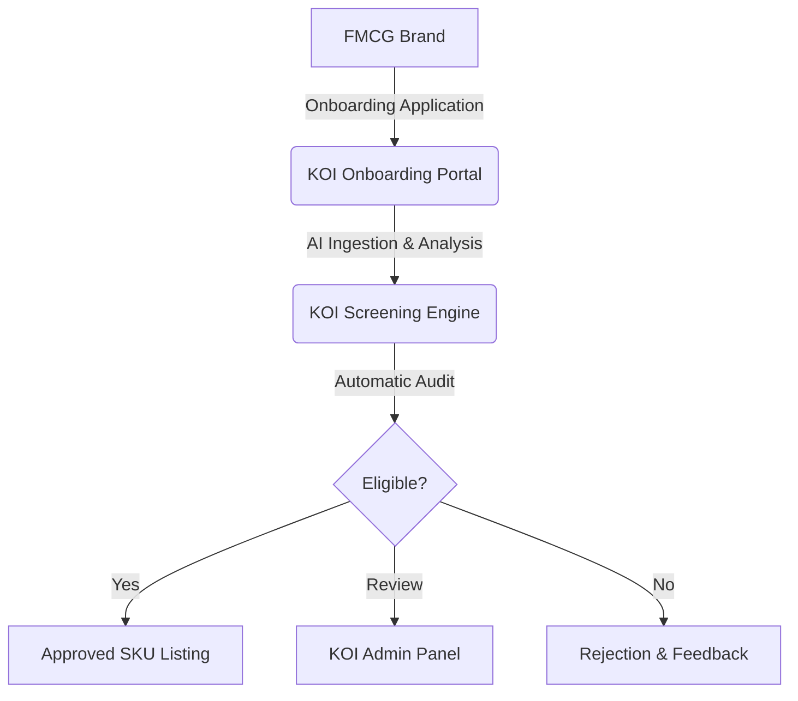
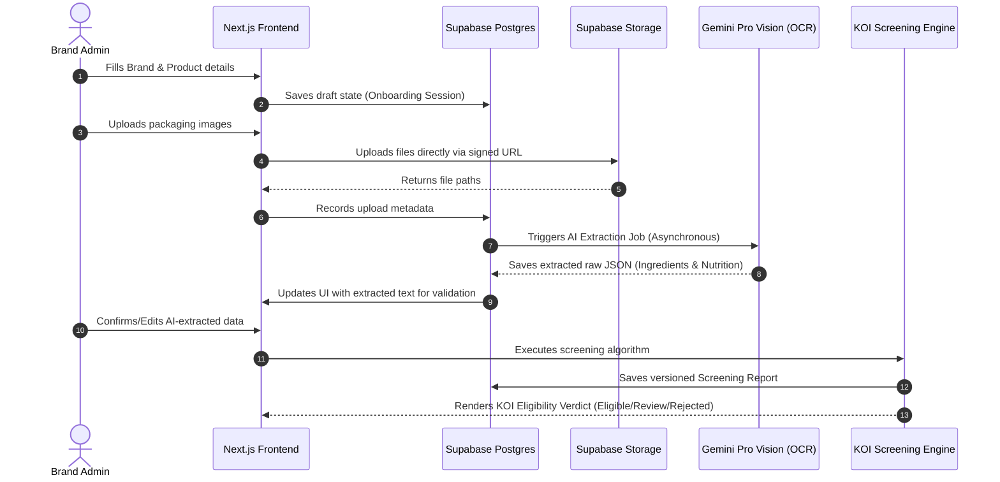
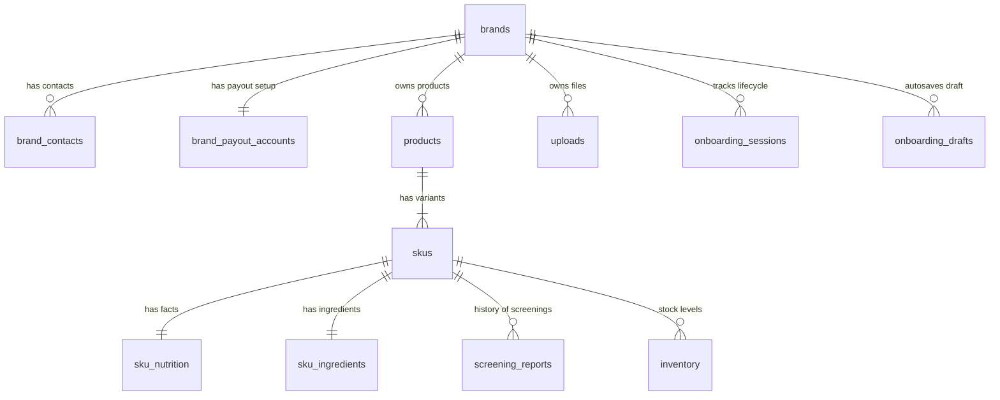
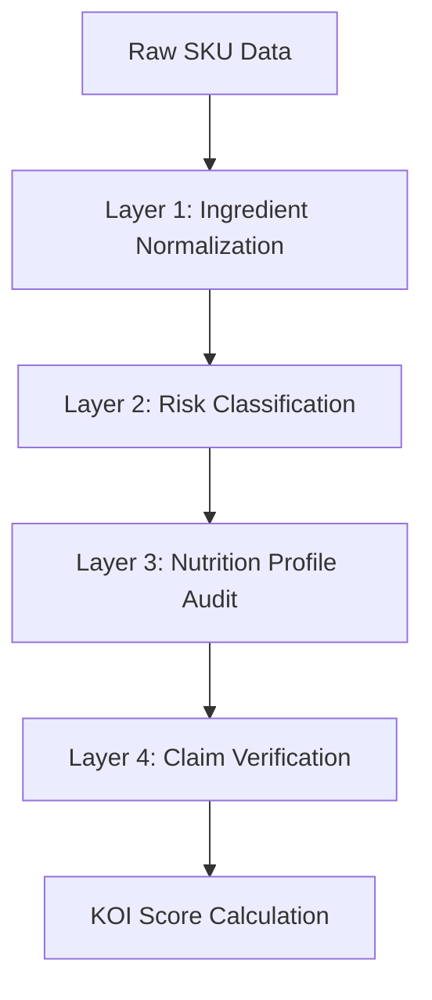
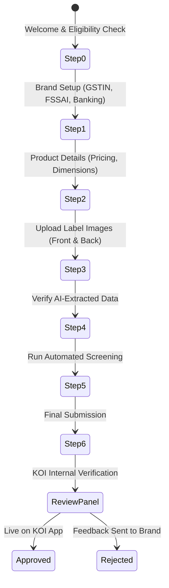
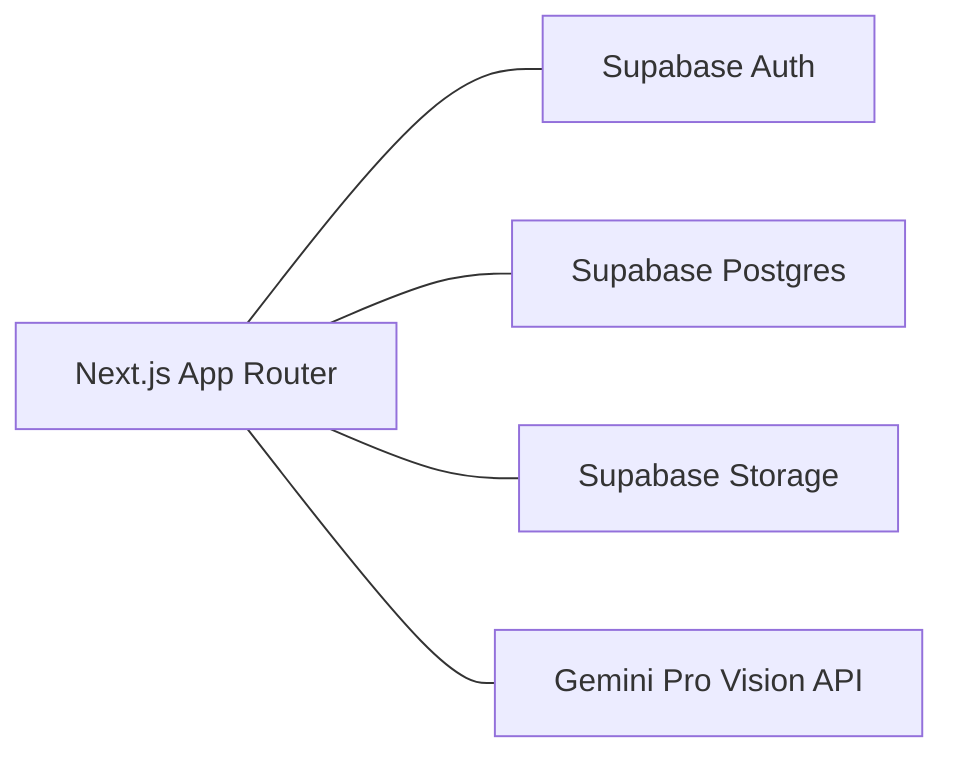

# KOI Module 1 — Brand Onboarding System Documentation

## 1. Executive Summary

KOI is a health-first quick commerce platform in India dedicated to delivering healthy, clean-label, and nutritionally trustworthy products. Unlike traditional quick-commerce platforms that prioritize catalog size over quality, KOI operates on strict eligibility criteria. 

**Module 1: Brand Onboarding System** is the gateway to the KOI ecosystem. It is a product intelligence engine designed to collect brand data, ingest product specifications, parse packaging labels using AI, run an automated health-screening algorithm, and manage the administrative approval workflow. This system ensures that only verified, healthy SKUs make it to our dark stores.



---

## 2. Problem Statement

The Indian packaged food and beverage market is growing rapidly, but it faces three critical challenges:
1. **Misleading Claims:** Labels often highlight "No Added Sugar" while packing high quantities of maltodextrin or fruit concentrates.
2. **Hidden Toxins & Additives:** Ultra-processed items contain hidden chemical additives (emulsifiers, preservatives, artificial sweeteners) masked under complex numbers (e.g., E322, INS322).
3. **Information Overload for Consumers:** The average consumer cannot decipher back-of-pack labels in seconds while shopping.

On the business side, traditional brand onboarding is highly manual, error-prone, and takes weeks. We need an automated, scientific, and frictionless way to onboard brands and verify their health claims at the SKU level in minutes, not weeks.

---

## 3. Business Vision

KOI’s goal is to establish the gold standard for nutritional trust in Indian e-commerce. By focusing on high-protein, gut-friendly, high-fiber, low-sugar, and clean-label items (e.g., Epigamia, Slurrp Farm), KOI builds a highly loyal customer base that shops without reading labels, trusting that KOI has done the vetting.

Module 1 establishes the **Product Intelligence Core**. Every product listed on KOI starts as verified data, giving us the proprietary metadata required to power future features like personalized allergy filters, doctor-backed food recommendations, and transparent labeling displays.

---

## 4. Product Scope

| Feature | Description | Target User |
| :--- | :--- | :--- |
| **Brand Setup** | Ingestion of legal, tax (GSTIN), food safety licenses (FSSAI), and banking/payout details. | Brand Admin |
| **Product & SKU Creation** | Multi-variant product catalog setup (defining weights, packaging, costs, MRPs). | Brand Admin |
| **Document & Packaging Uploads** | High-fidelity image and document uploads (front/back labels, FSSAI certificates). | Brand Admin |
| **AI Extraction Pipeline** | Automated optical parsing of raw ingredients, nutrition facts, and marketing claims. | KOI System / Brand |
| **Ingredient & Claim Screening** | Automated audit against global food safety standards and KOI's risk rules. | KOI Engine |
| **Onboarding Lifecycle Management** | State machine governing drafts, submissions, manual reviews, and listings. | KOI Admins / Brands |

---

## 5. System Architecture

KOI uses a modern, serverless architecture powered by Next.js and Supabase. The system is designed to handle high-volume uploads and process them asynchronously via AI workers.



---

## 6. Database Design

### Database ERD


### Key Architectural Decisions

1. **SKU as the Atomic Unit of Health & Commerce**
   * *Why:* Nutrition values, ingredient ratios, and allergens vary drastically by variant. (e.g., Epigamia Greek Yogurt Strawberry contains fruit preparation and sugar, while Epigamia Greek Yogurt Natural has zero added sugar). Committing calculations to the SKU level prevents faulty claims.
2. **Normalized Master Ingredients Catalog (`ingredients_master`)**
   * *Why:* Additives hide behind different names. INS322, E322, and Soy Lecithin are the exact same ingredient. We normalize all inputs to canonical ingredients to ensure accurate risk profiling.
3. **State Persistence (`onboarding_drafts`)**
   * *Why:* Onboarding requires legal and scientific data. It is a high-friction process. Autosaving the draft state prevents session timeout data loss, increasing overall conversion.
4. **Immutable Audit Trails (`audit_logs`)**
   * *Why:* If a product causes a health incident or a brand edits a verified label post-approval, we need an untamperable audit log of who edited what, when, and who approved it.

---

## 7. The Screening Engine

The screening engine processes SKU data through four sequential validation layers.



### Layer 1: Ingredient Normalization
Using the `ingredients_master` dictionary, the engine parses raw text and matches abbreviations, E-codes, and local names into standardized terms.
* *Example:* "Lecithin (INS 322i)" $\rightarrow$ **Soy Lecithin**

### Layer 2: Ingredient Risk Classification
Every normalized ingredient is assigned a risk level based on clean-label research:
* **Safe:** Whole foods, natural spices, water.
* **Caution:** Minor preservatives or stabilizers (e.g., Xanthan Gum).
* **Risky:** Artificial sweeteners (e.g., Sucralose, Aspartame), seed oils.
* **Blocked:** Banned dyes, trans-fats, high-risk chemical preservatives (e.g., Butylated Hydroxyanisole).

### Layer 3: Nutrition Profile Audit
Evaluates macronutrients against strict thresholds (categorized by food vs. beverage):
* Sugars must not exceed $10\text{g}$ per $100\text{g}$ for foods.
* Sodium must align with recommended daily allowances.
* Checks ratio of protein and fiber relative to total carbohydrates.

### Layer 4: Claim Verification
Cross-references front-of-pack marketing claims with back-of-pack reality:
* *Claim:* "Sugar-Free" $\rightarrow$ Engine checks if `sugars_g` is $\le 0.5\text{g}$ and flags any hidden artificial sweeteners.

### Scoring Logic
$$\text{Final KOI Score} = (w_1 \times \text{Ingredient Score}) + (w_2 \times \text{Nutrition Score}) + (w_3 \times \text{Processing Score}) + (w_4 \times \text{Claim Score})$$

* **Eligible ($\ge 80$):** Instantly ready for listing once manual FSSAI checks pass.
* **Needs Review ($60-79$):** Requires a human nutritionist to verify the claims/warnings.
* **Rejected ($< 60$ or any Blocked ingredient):** Automatic rejection with structured feedback to the brand.

---

## 8. User Flow



### User Flow Detail

#### Step 0: Welcome & Eligibility Check
* **Goal:** Filter out non-eligible brands before they waste time.
* **UX:** Short questionnaire (e.g., "Do any of your products contain hydrogenated vegetable oil?").

#### Step 1: Brand Setup
* **Goal:** Capture legal identity.
* **Engine Action:** Validates GSTIN format via regex and matches legal entity names.

#### Step 2: Product & SKU Setup
* **Goal:** Capture logistics information.
* **UX:** Dynamic variant creator (allows setup of flavor and packaging configurations quickly).

#### Step 3: Packaging Upload
* **Goal:** Gather files for OCR.
* **UX:** Drag-and-drop file uploader with instant previews.

#### Step 4: AI Extraction Review
* **Goal:** Let the user check AI outputs.
* **UX:** Split-screen interface. Left: Uploaded image. Right: Editable form fields parsed by AI.

#### Step 5: KOI Screening
* **Goal:** Run the automated health checks.
* **UX:** Dynamic score meter showing a visual breakdown of ingredient quality.

#### Step 6: Final Submission
* **Goal:** Lock data for audit.
* **Engine Action:** Freezes drafts and submits the application to the admin panel.

---

## 9. UI/UX Philosophy

Our visual design communicates **scientific credibility and premium quality**. 

* **The Palette:** Earthy forest greens, warm cream backgrounds, and refined charcoal text. We avoid saturated "neon" greens and aggressive SaaS gradients.
* **Typography:** Elegant Sans-Serif font hierarchy (e.g., *Inter* or *Outfit*) to ensure readability of micro-nutrition grids.
* **Zero Clutter:** Data tables resemble clean medical sheets or premium consumer packaging.
* **Micro-interactions:** Smooth loading indicators during OCR extraction keep the user engaged and reduce perceived wait times.

---

## 10. Technical Stack



* **Frontend:** Next.js (App Router, React). Highly performant, optimized for SEO, and ideal for server-rendered dashboards.
* **Database & Auth:** Supabase (Postgres). Enables Postgres extensions like `pgcrypto` for secure column encryption.
* **Storage:** Supabase Storage. Handles heavy PDF and image files with signed URL access.
* **AI Engine:** Google Antigravity SDK & Gemini Pro Vision. Powers rapid, highly accurate OCR label reads.

---

## 11. Future Roadmap

```mermaid
gantt
    title KOI Platform Roadmap
    dateFormat  YYYY-MM
    section Core Listing
    Module 1: Brand Onboarding System    :active, m1, 2026-06, 2026-08
    section Operations
    Module 2: Admin & Partner Dashboard  :after m1, m2, 2026-08, 2026-10
    Module 3: Inventory & Dark Store OMS :m3, 2026-10, 2026-12
    section Growth
    Module 4: Analytics & Brand Insights :m4, 2026-12, 2027-02
    Module 5: Personalized Recommendation Engine :m5, 2027-02, 2027-05
```

---

## 12. Engineering Notes

> [!IMPORTANT]
> **Encryption Guideline:** Decrypted banking/payout details must never travel over public client networks. Decryption keys must reside strictly in server environment variables.

### Row Level Security (RLS)
The database enforces strict RLS policies to isolate tenant data:
* Brands can only query their own `products`, `skus`, `uploads`, and `screening_reports`.
* Query validation logic: `auth.uid() = owner_id`.

### Storage Bucket Configurations
1. `brand-assets`: Brand logos, publicly readable.
2. `product-images`: Publicly readable once SKU is approved.
3. `label-uploads`: Private bucket; accessed only via short-lived signed URLs. Used for OCR extraction.
