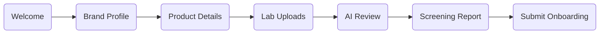

# KOI Phase 2A — Frontend Foundation Documentation

## 1. Executive Summary

KOI is a health-first quick commerce platform in India designed to onboard only healthy, nutritionally trustworthy products. Products must meet strict screening guidelines before they are listed on the platform. These criteria include high-protein profiles, gut-friendly ingredients, high fiber content, low sugar levels, and clean labels.

To support this business logic, **Module 1 — Brand Onboarding System** enables Fast-Moving Consumer Goods (FMCG) brands to register their profiles and submit their product catalogs for automated, AI-driven nutritional screening.

**Phase 2A (Frontend Foundation Setup)** establishes a highly scalable, production-grade frontend architecture. To prevent architectural debt, this phase focused entirely on tooling, state management, design tokens, utility helpers, and backend client integrations before implementing the user interface. No actual onboarding screens were built during this phase.

---

## 2. Phase Objective

The core objective of Phase 2A was to set up a robust frontend scaffolding that guarantees performance, maintainability, and consistency across the onboarding flow. 

This phase successfully completed:
1. Bootstrapping a modern JavaScript Next.js environment.
2. Integrating Tailwind CSS v4 compiler configurations.
3. Setting up shadcn/ui components and design system variables.
4. Implementing a centralized Zustand state machine to track form progress.
5. Setting up a singleton Supabase client factory for stable real-time communication.
6. Creating basic helper functions and a folder structure optimized for scale.

---

## 3. Technology Stack

To meet our performance and clean-code requirements, the following tech stack was selected and installed:

| Technology | Purpose | Version |
| :--- | :--- | :--- |
| **Next.js** | Core React framework using App Router for server-side and client-side routing. | `16.2.9` |
| **React** | Underlying frontend library, utilizing React 19 capabilities. | `19.2.4` |
| **Tailwind CSS** | Styling compiler using v4 architecture for sub-millisecond utility compile times. | `4.x` |
| **shadcn/ui** | Copy-paste UI primitives built on top of Radix primitives for accessibility and control. | `4.11.0` |
| **Zustand** | Minimalist client-side state manager to store data across the multi-step wizard. | `5.0.14` |
| **React Hook Form** | Form library implementing uncontrolled inputs to eliminate state render lag. | `7.79.0` |
| **Zod** | Schema validation tool to check structural data types at runtime. | `4.4.3` |
| **Supabase JS Client** | Official library to read and write records to our Postgres database. | `2.108.2` |
| **Framer Motion** | Animation engine to support high-performance micro-interactions. | `12.40.0` |
| **react-dropzone** | Standardized, accessible drag-and-drop component for lab report uploads. | `15.0.0` |
| **Lucide React** | Clean, modern vector icon set. | `1.20.0` |

---

## 4. Architectural Decisions

Below are the engineering rationales behind the main technical selections of the project:

### 4.1. Next.js (App Router, JavaScript)
- **Why**: Next.js is the standard framework for production React applications. The App Router provides layout nesting, server-side page speed optimizations, and SEO-friendly metadata setups.
- **Rationale**: The onboarding portal will have public-facing welcome screens and static information that must load instantly for prospective partners. Next.js allows us to leverage Static Site Generation (SSG) for public paths while using dynamic client-side rendering (CSR) for the interactive onboarding wizard.

### 4.2. Tailwind CSS v4 + shadcn/ui
- **Why**: Tailwind CSS v4 moves configurations out of JS config files and directly into standard CSS files using `@theme inline`. shadcn/ui provides clean primitives (buttons, labels, dialogs) that are copy-pasted directly into our code directory.
- **Rationale**: We reject heavy component libraries that pollute the package footprint and lock engineers into restricted API choices. By copy-pasting components into `components/ui`, we can customize their CSS rules using the KOI design system tokens directly.

### 4.3. Zustand over Redux
- **Why**: Zustand is a client-side state manager with practically zero boilerplate. It does not require Context Providers, action creators, or reducers.
- **Rationale**: A multi-step brand onboarding flow is a transient single-page wizard. Using Redux would introduce dozens of files and complex action mappings. Zustand allows us to define our state and state mutation actions in a single, simple file ([onboardingStore.js](file:///c:/Users/KIIT0001/OneDrive/Attachments/Desktop/Antigravity/KOI-PLATFORM/web/src/store/onboardingStore.js)) containing under 70 lines of code.

### 4.4. React Hook Form + Zod
- **Why**: Standard React form inputs cause the entire page to re-render on every keystroke, leading to input lag. React Hook Form relies on uncontrolled inputs, reading values only when needed. Zod allows developer-friendly schema-driven validation.
- **Rationale**: FMCG onboarding forms contain hundreds of inputs (ingredient listings, manufacturing addresses, protein counts). Uncontrolled inputs keep typing latency at 0ms. Zod validates complex structures (e.g., matching nutritional ratios) and exposes human-readable errors.

### 4.5. Singleton Supabase Client
- **Why**: Creating Supabase client instances dynamically on client pages can spawn dozens of concurrent connections.
- **Rationale**: In Next.js, Hot Module Replacement (HMR) during development and frequent client re-renders can re-run creation logic. By enclosing client creation inside a singleton factory ([client.js](file:///c:/Users/KIIT0001/OneDrive/Attachments/Desktop/Antigravity/KOI-PLATFORM/web/src/lib/supabase/client.js)), we preserve a single socket instance, preventing rate limits and connection pooling issues.

### 4.6. Design-First Configuration Before UI Build
- **Why**: UI screens implemented before setting up theme tokens invariably end up containing mismatched, arbitrary hex colors and inconsistent typography.
- **Rationale**: Establishing design system rules inside [globals.css](file:///c:/Users/KIIT0001/OneDrive/Attachments/Desktop/Antigravity/KOI-PLATFORM/web/src/app/globals.css) and [layout.js](file:///c:/Users/KIIT0001/OneDrive/Attachments/Desktop/Antigravity/KOI-PLATFORM/web/src/app/layout.js) guarantees that all developers use tailwind tokens (e.g. `bg-primary`, `font-display`, `text-success`) instead of ad-hoc CSS rules.

---

## 5. Project Structure

The project code is modularized within the `web/` directory. Files are separated by concern to keep files clean and maintainable for future interns:

```
web/
├── src/
│   ├── app/
│   │   ├── onboarding/
│   │   │   ├── page.js          # Entry point for the Onboarding wizard layout
│   │   │   └── success/
│   │   │       └── page.js      # Success screen redirect on form completion
│   │   ├── globals.css          # Tailwind configurations and KOI color variables
│   │   └── layout.js            # App wrapper, Google Font loaders, and Toast Provider
│   ├── components/
│   │   ├── ui/                  # Raw UI components managed by shadcn
│   │   └── onboarding/          # Feature components for the onboarding module
│   │       ├── layout/          # Layout blocks (e.g., Progress bars, Wizard Navigation)
│   │       ├── common/          # Sharable onboarding items (e.g., Bullet checklists)
│   │       └── steps/           # Form step components (e.g., Brand details, Lab uploads)
│   ├── lib/
│   │   ├── supabase/
│   │   │   └── client.js        # Supabase client singleton setup
│   │   ├── validations/         # Zod schemas for validating steps
│   │   ├── constants/           # Core static configurations (categories, options)
│   │   └── utils.js             # Utility scripts, including Class Name merging
│   ├── store/
│   │   └── onboardingStore.js   # Zustand store for global onboarding progress
│   └── hooks/                   # Custom React hooks (e.g., database auto-saves)
```

- **`app/`**: Next.js routing and top-level pages.
- **`components/ui/`**: Base UI elements (e.g. buttons, labels). These should not contain business logic.
- **`components/onboarding/`**: Step screens and custom layout elements specific to onboarding logic.
- **`lib/`**: Helpers, constants, validations, and client setups.
- **`store/`**: Global client-side application state.
- **`hooks/`**: Specialized React hooks (e.g., triggers for network synchronization).

---

## 6. Design System

KOI targets premium FMCG brands, requiring a UI that feels modern, scientific, and enterprise-grade. The interface is clean, spacious, and scientifically credible.

### 6.1. Typography
Two Google fonts are pre-configured in [layout.js](file:///c:/Users/KIIT0001/OneDrive/Attachments/Desktop/Antigravity/KOI-PLATFORM/web/src/app/layout.js):
- **`Space Grotesk` (Headings)**: A geometric sans-serif that provides a tech-forward, analytical look.
- **`Inter` (Body Text)**: A highly legible sans-serif optimal for reading fine-print nutritional tables.

### 6.2. Color Tokens
The custom colors are declared in [globals.css](file:///c:/Users/KIIT0001/OneDrive/Attachments/Desktop/Antigravity/KOI-PLATFORM/web/src/app/globals.css):

| Token | Hex Value | Practical Application |
| :--- | :--- | :--- |
| **`background`** | `#F7F5F1` | Warm, clean off-white canvas. Natural and organic feel. |
| **`card`** | `#FFFFFF` | Clear contrast container backgrounds. |
| **`primary`** | `#184D3B` | Deep Forest Green. Conveys health, authority, and premium credibility. |
| **`text`** | `#171717` | Ink Black. Extremely readable, clean contrast. |
| **`muted`** | `#6B7280` | Gray. Used for descriptive notes and placeholder guides. |
| **`border`** | `#E8E5DF` | Soft warm border divider. |
| **`success`** | `#1F7A4D` | Calm green indicating passed nutritional screenings. |
| **`warning`** | `#D9A441` | Gold indicating warnings (e.g., borderline sugar limits). |
| **`danger`** | `#C94B40` | Red indicating failed checks or critical onboarding errors. |

---

## 7. State Management

The wizard flow maintains a centralized client-side store written in Zustand. It keeps data in memory as the user goes back and forth through the pages before final database commit.

### 7.1. State Schema
The Zustand store in [onboardingStore.js](file:///c:/Users/KIIT0001/OneDrive/Attachments/Desktop/Antigravity/KOI-PLATFORM/web/src/store/onboardingStore.js) tracks:

```javascript
currentStep: 'welcome',   // Active step in the onboarding flow
draftId: null,            // Supabase onboarding draft database ID
brandData: {},            // Brand fields (registered name, registration numbers)
productData: {},          // Basic product details (name, description, categories)
skuData: {},              // SKU specifics (weight, unit counts)
uploads: [],              // Arrays of uploaded lab documents and certificates
aiExtraction: null,       // Extracted raw nutritional data from AI parser
screeningReport: null,    // AI-generated health screening report
isSaving: false,          // Sync status flag
lastSavedAt: null         // Timestamp of last auto-sync to Supabase
```

### 7.2. Step Pipeline
Onboarding progresses through seven sequential steps:



1. **`welcome`**: Introduction, overview of guidelines, and eligibility checklist.
2. **`brand`**: Brand profile details (Company Name, GST, Address).
3. **`product`**: Product catalog definitions (Category, Claims, Target Audience).
4. **`upload`**: Drag-and-drop file upload for official lab certificates and PDFs.
5. **`ai_review`**: Extracted AI values shown to the user for validation and edit.
6. **`screening`**: Real-time screening report showing which health checks passed or failed.
7. **`submit`**: Review all data and sign off to push to KOI admin reviewers.

### 7.3. Store Actions
- **`setField(field, value)`**: Sets a global root-level store key.
- **`updateData(section, data)`**: Deep-merges partial updates into state keys (e.g. `brandData`).
- **`nextStep()` / `prevStep()`**: Standard navigation boundaries using a predefined steps list.
- **`setSaving(status)`**: Toggles database loading indicator.
- **`setLastSaved()`**: Records timestamp of successful DB syncing.
- **`reset()`**: Restores the store to default state upon successful submission.

---

## 8. Supabase Integration

The Supabase client is initialized as a singleton using the client factory inside [client.js](file:///c:/Users/KIIT0001/OneDrive/Attachments/Desktop/Antigravity/KOI-PLATFORM/web/src/lib/supabase/client.js).

### 8.1. Client Factory Code

```javascript
import { createClient } from '@supabase/supabase-js'

let client = null

export function getSupabaseClient() {
    if (!client) {
        client = createClient(
            process.env.NEXT_PUBLIC_SUPABASE_URL,
            process.env.NEXT_PUBLIC_SUPABASE_ANON_KEY
        )
    }
    return client
}
```

> [!NOTE]
> Setting up the client as a singleton ensures that Next.js HMR does not instantiate duplicate web-sockets, which avoids backend memory leaks and protects the application from rate limits during development.

---

## 9. Utilities

We utilize a core helper function inside [utils.js](file:///c:/Users/KIIT0001/OneDrive/Attachments/Desktop/Antigravity/KOI-PLATFORM/web/src/lib/utils.js) to resolve dynamic class application issues.

### 9.1. Class Name Merger (`cn`)
The `cn` helper uses `clsx` and `tailwind-merge` under the hood:

```javascript
import { clsx } from "clsx";
import { twMerge } from "tailwind-merge"

export function cn(...inputs) {
  return twMerge(clsx(inputs));
}
```

- **Why it is needed**: shadcn/ui components expose base styles (e.g., standard padding `p-4`). If we pass a custom styling prop like `className="p-6"` from a parent layout, standard string concatenation would apply both `p-4` and `p-6` to the element, causing styling bugs.
- **How it works**: `clsx` enables clean conditional class strings, and `tailwind-merge` intelligently overrides older conflicting utility classes with the latest ones (resolving `p-4` vs `p-2` safely).

---

## 10. Phase Deliverables

At the conclusion of Phase 2A, the following tasks were completed and verified:

- [x] **Next.js Project Scaffolding**: Configured framework structures under the `web/` workspace directory.
- [x] **Tailwind CSS v4 Configuration**: Configured theme files. Built custom variants and base parameters.
- [x] **shadcn/ui Initialization**: Configured `components.json`. Established target directories for components.
- [x] **Component Assembly**: Installed button, card, input, label, textarea, progress, badge, dialog, toast, and tabs components under the `web/src/components/ui/` folder.
- [x] **Font Binding**: Integrated Inter (sans) and Space Grotesk (headings) using `next/font/google`.
- [x] **Zustand Store implementation**: Created [onboardingStore.js](file:///c:/Users/KIIT0001/OneDrive/Attachments/Desktop/Antigravity/KOI-PLATFORM/web/src/store/onboardingStore.js) managing variables and navigation flow.
- [x] **Supabase Client**: Singleton instance created and validated.
- [x] **Utilities Setup**: Configured class merge function (`cn`).

---

## 11. Next Steps

With the foundation complete, the onboarding system moves to **Phase 2B: Design System + Step 0 Welcome Screen**.

Key focus items for the next phase:
1. **Interactive Visual Styling**: Styling custom buttons, cards, and forms utilizing our configured design tokens.
2. **Step 0 Welcome Screen**: Designing the welcome screen containing eligibility checklists.
3. **Step 1 Brand Profile Form**: Implementing Zod validations for the brand schema and connecting the forms to Zustand state.
4. **Draft Persistence**: Creating React hooks to automatically write database records to the `onboarding_drafts` table on step changes.
